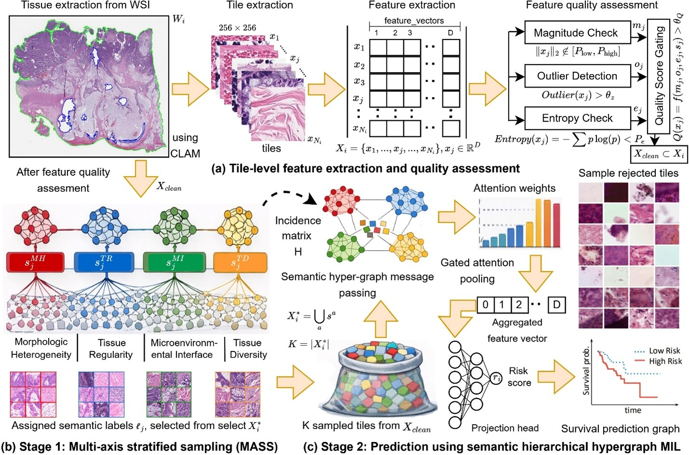

<h1 align="center">
  TRIAGE-MIL: Multi-Axis Instance Selection and Semantic Hypergraph Modeling <br>
  for Survival Prediction from Whole-Slide Images
</h1>

<p align="center">
  ✨🌟 <b>MICCAI 2026 — Provisionally Accepted</b> 🌟✨
</p>

<p align="center">
  <b>🔬 Computational Pathology</b> &nbsp;|&nbsp;
  <b>🧠 Survival Prediction</b> &nbsp;|&nbsp;
  <b>🧩 Multiple Instance Learning</b> &nbsp;|&nbsp;
  <b>🌐 Hypergraph Modeling</b>
</p>

<p align="center">
  
  
  
  
</p>

<p align="center">
  Official implementation of <b>TRIAGE-MIL</b>, a weakly supervised survival prediction framework for whole-slide images.
</p>

<p align="center">
  
</p>

---

## 📚 Table of Contents

- [📌 Overview](#-overview)
- [🧬 Framework](#-framework)
- [🔎 MASS: Multi-Axis Stratified Sampling](#-mass-multi-axis-stratified-sampling)
- [🌐 Semantic Hierarchical Hypergraph](#-semantic-hierarchical-hypergraph)
- [📁 Repository Structure](#-repository-structure)
- [🧾 Data Preparation](#-data-preparation)
- [📄 Label File Format](#-label-file-format)
- [🔀 Cross-Validation Split Format](#-cross-validation-split-format)
- [⚙️ Installation](#️-installation)
- [🛠️ Configuration](#️-configuration)
- [🚀 Step 1: MASS Top-k Tile Selection](#-step-1-mass-top-k-tile-selection)
- [🧩 Step 2: Precompute Semantic Hierarchical Hypergraphs](#-step-2-precompute-semantic-hierarchical-hypergraphs)
- [🏋️ Step 3: Train TRIAGE-MIL](#️-step-3-train-triage-mil)
- [📈 Step 4: Kaplan–Meier and Log-rank Analysis](#-step-4-kaplanmeier-and-log-rank-analysis)
- [🗂️ Datasets](#️-datasets)
- [🏆 Results](#-results)
- [🔬 Ablation Study](#-ablation-study)
- [🎯 Interpretability](#-interpretability)
- [📦 Pretrained Models and Features](#-pretrained-models-and-features)
- [📚 Citation](#-citation)
- [🙏 Acknowledgements](#-acknowledgements)
- [📬 Contact](#-contact)

---

## 📌 Overview

**TRIAGE-MIL** is a two-stage weakly supervised framework for survival prediction from whole-slide images (WSIs).

Whole-slide images contain tens of thousands of tiles, but only a subset may carry prognostic information. Standard MIL models often treat tiles as unordered independent instances, while graph-based MIL models are usually limited to pairwise relationships. TRIAGE-MIL addresses these limitations by selecting prognostically informative tiles and modeling higher-order tissue relationships through semantic hypergraphs.

TRIAGE-MIL combines three key components:

1. **MASS: Multi-Axis Stratified Sampling**  
   An unsupervised tile selection strategy that selects a fixed-size subset of informative tiles.

2. **Semantic hierarchical hypergraph modeling**  
   A higher-order relational module that captures intra- and inter-tissue relationships beyond pairwise graph edges.

3. **Gated-attention MIL survival prediction**  
   A patient-level survival prediction module trained using Cox partial likelihood.

---

## 🧬 Framework

TRIAGE-MIL consists of the following pipeline:

1. **WSI preprocessing using CLAM**
   - Tissue masking
   - Tile extraction
   - Coordinate generation

2. **Feature extraction using UNI**
   - Non-overlapping **256 × 256** tiles are extracted at **20× magnification**.
   - Tile-level features are encoded using the **UNI pathology foundation model**.
   - Each tile is represented by a **1024-dimensional embedding**.

3. **Feature quality filtering**
   - Low-quality or uninformative tile embeddings are removed using statistical criteria:
     - feature magnitude filtering using P2/P98
     - outlier filtering using z-threshold = 3.5
     - entropy filtering using P3
     - composite quality threshold \(Q(x_j) \geq 0.30\)

4. **MASS tile selection**
   - A fixed budget of **K = 4096** tiles is selected per WSI.
   - Selection is performed using four phenotype-inspired axes.

5. **Semantic hierarchical hypergraph construction**
   - Selected tiles are grouped into semantic super-nodes using k-means clustering in embedding space.
   - Hyperedges model containment, intra-semantic similarity, and inter-semantic interactions.

6. **Survival prediction**
   - Final tile representations are aggregated using gated attention pooling.
   - A patient-level risk score is predicted using Cox survival loss.

---

## 🔎 MASS: Multi-Axis Stratified Sampling

**MASS** reduces a large WSI tile bag into a compact, informative subset.

Given tile embeddings from a WSI, MASS first applies feature-space quality filtering and then selects tiles using four phenotype-inspired axes:

| Axis | Description |
|---|---|
| **Morphologic Heterogeneity (MH)** | Selects tiles with high morphologic variability using feature variance. |
| **Tissue Regularity (TR)** | Selects structured or regular tissue patterns using feature magnitude-to-variance ratio. |
| **Microenvironmental Interface (MI)** | Selects spatial neighborhoods with high local variation, capturing interface-like regions. |
| **Tissue Diversity (TD)** | Selects rare or underrepresented morphologies using farthest-point sampling in feature space. |

The selected tile subset is assigned semantic labels corresponding to these four axes. These semantic labels are later used for semantic hypergraph construction.

Default MASS axis fractions are provided in the public-release implementation. Dataset-specific fractions can be supplied through the command-line arguments in `mass_selector.py`.

---

## 🌐 Semantic Hierarchical Hypergraph

TRIAGE-MIL represents MASS-selected tiles using a semantic hierarchical hypergraph.

For each MASS semantic label, selected tiles are clustered in embedding space using k-means to form semantic super-nodes. The number of super-nodes is determined by the fixed granularity of `tiles_per_super = 12`.

The tile-level incidence matrix contains three hyperedge families:

- **Containment hyperedges:** tiles assigned to the same super-node.
- **Intra-semantic hyperedges:** an anchor super-node plus nearest super-nodes from the same MASS label.
- **Inter-semantic hyperedges:** an anchor super-node plus nearest super-nodes from allowed different MASS labels.

This design allows TRIAGE-MIL to model higher-order tissue organization, including relationships among tumor-associated regions, stromal structures, tissue interfaces, and morphologically diverse regions.

---

## 📁 Repository Structure

```text
TRIAGE-MIL/
├── assets/
│   ├── TRIAGE_MIL_framework.jpg
│   ├── MASS_stratification.jpg
│   └── example_km_curves.jpg
│
├── configs/
│   └── config_TRIAGE_MIL_CLAM_UNI_5fold.json
│
├── src/
│   ├── mass_core.py
│   ├── mass_io_utils.py
│   ├── mass_selector.py
│   ├── precompute_hypergraphs.py
│   ├── train_triage_mil.py
│   └── km_analysis.py
│
├── scripts/
│   ├── run_mass_selection.sh
│   ├── run_precompute_hypergraphs.sh
│   ├── train_5fold.sh
│   └── run_km_analysis.sh
│
├── clinical_data/
│   ├── TCGA_BLCA_survival_format_MONTHS_2dp.csv
│   ├── TCGA_BRCA_survival_format_MONTHS_2dp.csv
│   ├── TCGA_STAD_survival_format_MONTHS_2dp.csv
│   ├── TCGA_LUAD_survival_format_MONTHS_2dp.csv
│   └── TCGA_COADREAD_survival_format_MONTHS_2dp.csv
│
├── splits/
│   ├── TCGA_BLCA/
│   ├── TCGA_BRCA/
│   ├── TCGA_STAD/
│   ├── TCGA_LUAD/
│   └── TCGA_COAD_READ/
│
├── cache/
├── results/
├── requirements.txt
├── env.yaml
├── LICENSE
└── README.md
```

---

## 🧾 Data Preparation

### WSI Preprocessing

WSIs are processed using the **CLAM preprocessing pipeline**.

In the manuscript, WSIs were:

- processed at **20× magnification**
- tiled into **non-overlapping 256 × 256 patches**
- encoded using the **UNI foundation model**
- represented as **1024-dimensional tile embeddings**

Expected feature organization:

```text
data/features/
└── UNI/
    └── pt_files/
        ├── patient_001.pt
        ├── patient_002.pt
        ├── patient_003.pt
        └── ...
```

Each `.pt` file should contain:

```python
{
    "features": Tensor[N, D],
    "coords": Tensor[N, 2]
}
```

where:

- `N` is the number of tiles in the WSI
- `D` is the UNI feature dimension
- `coords` stores tile coordinates

---

## 📄 Label File Format

The survival label CSV should contain:

```text
patient_id,survival_time,survival_event
```

Example:

```text
patient_id,survival_time,survival_event
P001,42.5,1
P002,60.0,0
P003,18.2,1
```

| Column | Description |
|---|---|
| `patient_id` | Patient or WSI identifier matching the `.pt` filename |
| `survival_time` | Follow-up or survival time |
| `survival_event` | Event indicator, where `1 = event/death` and `0 = censored` |

---

## 🔀 Cross-Validation Split Format

TRIAGE-MIL uses patient-level stratified 5-fold cross-validation with three patient-disjoint subsets per fold:

`train`: model fitting
`val`: checkpoint selection / early stopping
`test`: final C-index and Kaplan–Meier analysis

Each fold split file should be stored as:

```text
splits/TCGA_LUAD/
├── fold_0.csv
├── fold_1.csv
├── fold_2.csv
├── fold_3.csv
└── fold_4.csv
```

Each `fold_*.csv` file should contain:

```text
patient_id,split
P001,train
P002,train
P003,val
P004,test
```

The `val` split is used only for checkpoint selection. The `test` split is not used during training or checkpoint selection.

---

## ⚙️ Installation

Create a conda environment:

```bash
conda create -n triage_mil python=3.10 -y
conda activate triage_mil
```

Install dependencies:

```bash
pip install -r requirements.txt
```

Minimal dependencies:

```text
numpy
pandas
scipy
scikit-learn
lifelines
h5py
tqdm
matplotlib
torch
torchvision
```

---

## 🛠️ Configuration

Edit the configuration file:

```bash
config/config_TRIAGE_MIL_CLAM_UNI_5fold.json
```

Example:

```json
{
  "feature_root": "./data/features",
  "selected_encoder": "UNI/pt_files",

  "csv_labels": "./clinical_data/TCGA_LUAD_survival_format_MONTHS_2dp.csv",
  "splits_dir": "./splits/TCGA_LUAD",

  "split_protocol": "patient_level_stratified_5fold_60_20_20",
  "split_col": "split",
  "train_label": "train",
  "val_label": "val",
  "test_label": "test",
  "checkpoint_metric": "val_cindex",
  "final_eval_split": "test",

  "id_col": "patient_id",
  "time_col": "survival_time",
  "event_col": "survival_event",

  "random_seed": 35,
  "device": "cuda",

  "max_tiles": 4096,

  "batch_size": 4,
  "gradient_accumulation_steps": 8,
  "lr": 0.0002,
  "weight_decay": 0.0001,
  "epochs": 200,

  "early_stopping": true,
  "early_patience": 40,
  "early_min_epochs": 60,
  "k_folds": 5,

  "heads": 6,
  "hidden": 512,
  "attn_dropout": 0.22,
  "num_hyper_layers": 4,
  "learnable_temp": true,

  "use_semantic_hierarchy": true,
  "semantic_hierarchy_config": {
    "enabled": true,
    "k_intra": 10,
    "k_inter": 5,
    "tiles_per_super": 12
  },

  "precompute_cache": {
    "cache_dir": "./cache/MASS_TOPK_TILES/CLAM_UNI"
  },

  "save_dir": "./results/TRIAGE_MIL_CLAM_UNI"
}
```

---

## 🚀 Step 1: MASS Top-k Tile Selection

Run MASS tile selection on CLAM-style UNI feature files:

```bash
python src/mass_selector.py \
  --feature-root ./data/features \
  --encoder UNI/pt_files \
  --out-cache ./cache/MASS_TOPK_TILES/CLAM_UNI \
  --topk 4096
```

Expected output:

```text
cache/MASS_TOPK_TILES/CLAM_UNI/
├── patient_001_topk_idx.npy
├── patient_001_topk_labels.npy
├── patient_001_topk_risks.npy
├── patient_001_mass_metadata.json
├── patient_002_topk_idx.npy
├── patient_002_topk_labels.npy
├── patient_002_topk_risks.npy
├── patient_002_mass_metadata.json
└── ...
```

You may also use:

```text
bash scripts/run_mass_selection.sh
```
---

## 🧩 Step 2: Precompute Semantic Hierarchical Hypergraphs

After MASS tile selection, precompute patient-level semantic hypergraphs:

```bash
python src/precompute_hypergraphs.py \
  --config configs/config_TRIAGE_MIL_CLAM_UNI_5fold.json
```

Expected output:

```text
cache/MASS_TOPK_TILES/CLAM_UNI/hypergraphs/
├── patient_001_H_k10_i5_t12.pt
├── patient_002_H_k10_i5_t12.pt
└── ...
```

Each hypergraph file contains:

- sparse tile-level hypergraph incidence matrix
- MASS labels
- tile-to-super-node metadata
- semantic super-node labels
- hypergraph metadata

You may also use:

```text
bash scripts/run_precompute_hypergraphs.sh
```

---

## 🏋️ Step 3: Train TRIAGE-MIL

Train a single fold:

```bash
python src/train_triage_mil.py \
  --config configs/config_TRIAGE_MIL_CLAM_UNI_5fold.json \
  --fold 0
```

Train all five folds:

```bash
bash scripts/train_5fold.sh
```
For each fold, the training script saves:

```text
results/TRIAGE_MIL_CLAM_UNI/
├── fold_0/
│   ├── best_model.pt
│   ├── split_used.csv
│   ├── training_log.csv
│   ├── train_predictions.csv
│   ├── val_predictions_at_best_checkpoint.csv
│   ├── val_predictions_final_checkpoint.csv
│   ├── test_predictions.csv
│   └── metrics_summary.json
└── ...
```
Validation predictions are used only for checkpoint selection. Final performance and Kaplan–Meier analysis should use `test_predictions.csv`.

---

## 📈 Step 4: Kaplan–Meier and Log-rank Analysis

After training, generate Kaplan–Meier curves and log-rank statistics:

```bash
python src/km_analysis.py \
  --predictions-dir ./results/TRIAGE_MIL_CLAM_UNI \
  --output-dir ./results/TRIAGE_MIL_CLAM_UNI/km_results \
  --method median
```

Expected outputs:

```text
results/TRIAGE_MIL_CLAM_UNI/km_results/
├── pooled_heldout_test_km_curves.png
├── pooled_heldout_test_predictions_with_groups.csv
├── km_fold_threshold_summary.csv
└── km_pooled_summary.csv
```
You may also use:

```text
bash scripts/run_km_analysis.sh
```

---

## 🗂️ Datasets

TRIAGE-MIL was evaluated on six H&E-stained FFPE WSI cohorts using one representative tumor slide per patient:

| Cohort         | Organ          | Number of Patients | Events | Censoring Rate |
| -------------- | -------------- | -----------------: | -----: | -------------: |
| In-House CRC   | Colon & Rectum |                790 |    228 |          71.1% |
| TCGA-BRCA      | Breast         |               1008 |    141 |          86.0% |
| TCGA-LUAD      | Lung           |                382 |    128 |          66.5% |
| TCGA-COAD-READ | Colon & Rectum |                565 |    120 |          78.8% |
| TCGA-STAD      | Stomach        |                365 |    145 |          60.3% |
| TCGA-BLCA      | Bladder        |                385 |    175 |          54.5% |


---

## 🏆 Results

TRIAGE-MIL was compared against 13 state-of-the-art MIL and survival prediction baselines:

- Max-Pooling
- Mean-Pooling
- ABMIL
- CLAM
- TransMIL
- DSMIL
- DTFD-MIL
- MambaMIL
- DeepAttnMISL
- OTSurv
- IB-MIL
- ILRA
- PANTHER

### C-index Performance

| Model | In-House CRC | LUAD | STAD | BLCA | BRCA | TCGA-CRC | Mean |
|---|---:|---:|---:|---:|---:|---:|---:|
| OTSurv | 0.695±0.028 | 0.663±0.074 | 0.630±0.027 | 0.618±0.026 | 0.643±0.026 | 0.665±0.050 | 0.652±0.028 |
| TRIAGE-MIL | **0.712±0.035** | **0.687±0.061** | **0.676±0.013** | **0.651±0.038** | **0.668±0.021** | **0.714±0.062** | **0.685±0.025** |

TRIAGE-MIL achieved the best mean C-index of **0.685**, improving over the strongest baseline, OTSurv, by **3.3 percentage points**.

Kaplan–Meier analysis showed significant risk-group separation across all six cohorts using held-out test predictions. Risk thresholds were estimated from the corresponding training-set median risk within each fold and applied to held-out test patients before pooling groups for log-rank testing.

---

## 🔬 Ablation Study

| Method | Mean C-index |
|---|---:|
| TRIAGE-MIL Final | **0.685±0.025** |
| w/o Quality-Aware Filtering | 0.676±0.026 |
| w/o MASS | 0.665±0.026 |
| w/o Semantic Labels | 0.672±0.026 |
| w/o Relational Modeling | 0.660±0.027 |
| w/o Hierarchical Super-nodes | 0.671±0.025 |

The largest performance drop occurs when relational modeling is removed, supporting the importance of hypergraph-based higher-order tissue relationship modeling.

---

## 🎯 Interpretability

TRIAGE-MIL provides tile-level attention maps over the MASS-selected tiles.

Because inference is performed only on the selected subset of **K = 4096** tiles, attention maps appear as sparse tile-level visualizations rather than dense pixel-level heatmaps.

The interpretability pipeline includes:

- tissue-type context maps
- TRIAGE-MIL attention maps
- MASS semantic category overlays
- representative top-attention tiles
- Kaplan–Meier risk-group visualization

---

## 📦 Pretrained Models and Features

Pretrained checkpoints, WSI files, clinical labels, and extracted UNI features are not included in this repository.

If permitted by institutional and data-use agreements, download links may be added later.

```text
Coming soon.
```

Do not upload protected clinical data, patient identifiers, restricted WSIs, or private institutional files to GitHub.

---

## 📚 Citation

If you find this work useful, please cite:

```bibtex
@inproceedings{triage_mil_2026,
  title     = {TRIAGE-MIL: Multi-Axis Instance Selection and Semantic Hypergraph Modeling for Survival Prediction from Whole-Slide Images},
  author    = {Barathi Subramanian and Rathinaraja Jeyaraj and Songmi Noh and George Fisher and Jeanne Shen},
  booktitle = {Medical Image Computing and Computer Assisted Intervention},
  year      = {2026},
  note      = {Provisionally accepted}
}
```

The official citation will be updated after publication.

---

## 🙏 Acknowledgements

This work uses and builds upon:

- **CLAM** for WSI tissue masking, patch extraction, and computational pathology MIL pipelines
- **UNI** for pathology foundation-model feature extraction
- **PyTorch** for deep learning implementation
- **lifelines** for survival analysis and Kaplan–Meier evaluation

Please cite the original CLAM and UNI papers when using this repository.

---

## 📬 Contact

For questions, please open an issue or contact the corresponding author.

---

<p align="center">
  ⭐ If you find this repository useful, please consider starring it. ⭐
</p>
